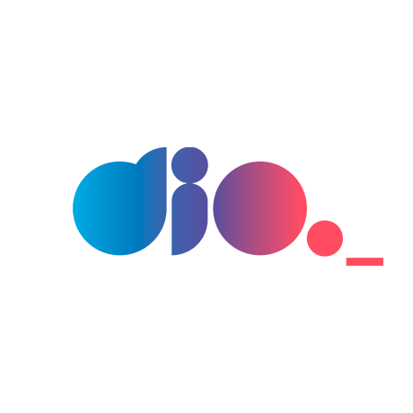

<h1>
    
     Repositório de Materiais de Estudo
</h1>
Repositório dedicado à organização e armazenamento de todos os materiais gerados durante minha jornada de aprendizado. Este Repo abrange em cada pasta à representação de uma tecnologia específica, contendo, códigos de exemplo, exercícios práticos e quaisquer outros recursos relevantes para a compreensão e aplicação dos conceitos abordados.
 
 

## Objetivo
Este repositório não apenas serve como um registro de minha jornada de aprendizado, mas também como uma ferramenta poderosa para revisão contínua e aprimoramento de habilidades. Ao centralizar todos os recursos relacionados à programação em um só lugar, posso otimizar meu tempo de estudo e maximizar meu progresso.
 
 

## Tecnologias Estudadas
<table>
  <thead>
    <tr align="left">
      <th>Nº</th>
      <th>Tecnologias</th>
      <th>Materiais de Estudo</th>
    </tr>
  </thead>
  <tbody align="left">
    <tr>
      <td>00</td>
      <td>VSCODE</td>
      <td align="center">
        
      </td>    
    </tr>
    <tr>
      <td>01</td>
      <td>GIT</td>
      <td align="center">
        
      </td>
    </tr>
    <tr>
      <td>02</td>
      <td>HTML & CSS</td>
      <td align="center">
        
      </td>    
    </tr>
    <tr>
      <td>03</td>
      <td>TYPESCRIPT</td>
      <td align="center">
        
      </td>    
    </tr>
    <tr>
      <td>04</td>
      <td>JAVASCRIPT</td>
      <td align="center">
        
      </td>
    </tr>
  </tbody>
  <tfoot></tfoot>
</table>
 

## 🚀 Metodologia de estudo
Utilizo uma metodologia de aprendizado em quatro passos. Primeiro, assisto à videoaula e busco a documentação da tecnologia estudada. Em seguida, transcrevo os pontos essenciais em um caderno e pratico o conteúdo. Essa abordagem me ajuda a consolidar o conhecimento. Apesar dos desafios e desânimos ao longo do caminho, percebi gradualmente a importância contínua do aprendizado. Estou motivado a continuar me dedicando ao meu crescimento profissional, estudando pelo menos 2 horas por dia e documentando meu progresso pelo <a href="https://www.linkedin.com/in/kevynfirst/recent-activity/all/">linkedin</a>.
 
 

## ⚡ Plataformas de estudo
<table>
 
  <tr>
    <td align="center">
      
       
    </td>
    <td align="center">
      
       
    </td>
    <!-- <td align="center">
      
       
    </td> -->
    <td align="center">
      
       
    </td>
    <td align="center">
      
       
    </td>
  </tr>
</table>

<!-- ##

Feito por 🚀<a href="https://github.com/kevynfirst">kevynfirst </a>
 -->
